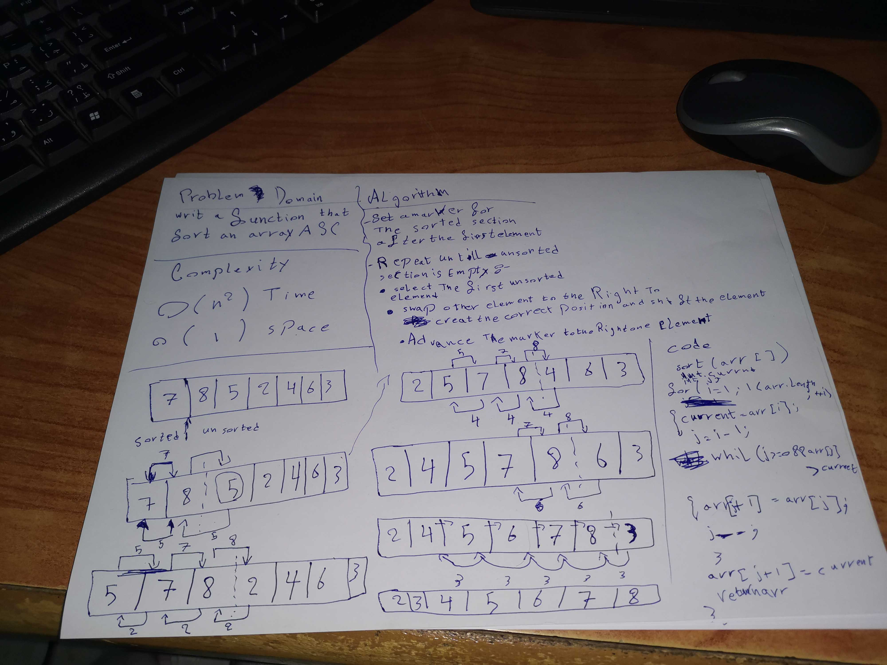

# Insertion
## Write a function for insertion sort that takes in an unsorted array and returns the array sorted using insertion sort.

## Whiteboard Process

## Approach & Efficiency
##  This solution takes O(n^2) time to run, where the worst case is the input array is reverse ordered. As for space, the solution takes O(1) space, only needing a few int variables for tracking.

## Solution

{,9,8,7,6,5,4,3,2,1}  Insertion.sort(arr)  [1,2,3,4,5,6,7,8,9]